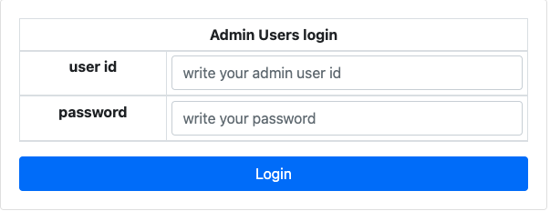
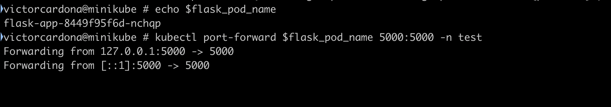
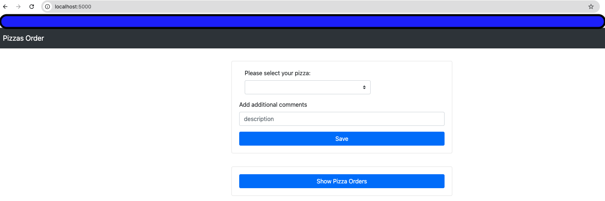

# flask-app-python

This project creates an app using flask and mysql. 
It is just for testing purposes. Please take into account that passwords cannot be 
exposed in code.

## How to deploy flask app  ##

Each one of the steps below allow you to deploy this flask app. To access the app once the configuration is done,
access it via web browser

 http://localhost:5000  or http://127.0.0.1:5000 

To access to the **admin page in flask app**, please use these values:



```
userid: 1000
password: admin
```


### You can deploy the app in different ways: ###

## 1. Deploy it using docker locally  ##

It was tested in `Docker version 26.1.1` running in Mac.<br/>
You need to install docker Desktop in your local machine.
To deploy it locally in docker just clone the repo and go to the directory where the repo was cloned. Once located there, execute these commands in sequence:

```
docker build -t my-flask-app .
```
```
docker network create my-flask-app-network
```
```
docker run --name mysql -p 3306:3306 --net my-flask-app-network -e MYSQL_PASSWORD="password" -e MYSQL_DATABASE="flask" -e MYSQL_ROOT_PASSWORD="password"  -ti -d mysql:8.0.39
```
```
docker run --name my-flask-app --net my-flask-app-network -p 5000:5000 -ti -d my-flask-app
```
Check that containers are up and running:

```
docker ps
```


Access it via web browser http://localhost:5000  or http://127.0.0.1:5000

## 2. Deploy it using docker-compose ##
It was tested in `Docker Compose version v2.27.0-desktop.2` running in Mac.<br/>
You need to install docker-compose in your local machine.
To deploy it locally using docker-compose just clone the repo and go to the directory where the repo was cloned. Once there:

```
docker-compose build
```
```
docker-compose up -d
```


## 3. Deploy it using minikube ##
It was tested in `minikube version: v1.33.1` running in Mac.<br/>
First, please ensure that you have minikube installed in your local machine.
Please check requirements and how to install it based on your OS.

Check this link ----> https://minikube.sigs.k8s.io/docs/start/?arch=%2Fmacos%2Fx86-64%2Fstable%2Fbinary+download <br/>
After installing it, please take into account that you need some minikube config before starting related to resources allocation
and allow minikube to access to internal and external resources (It can change based on OS):
```
minikube config set cpus 4
minikube config set memory 8200
minikube config set driver docker
```

To initiate minikube (It can change based on OS):
```
export HTTP_PROXY=https://minikube.sigs.k8s.io/docs/reference/networking/proxy/
minikube start --image-repository=auto --vm-driver=docker
```


To deploy the resources in minikube, go to the folder where resources are stored.
It was tested using helm `version.BuildInfo{Version:"v3.15.4"`

Go to folder:
```
cd minikube-resources
```

Create namespace first
```
kubectl apply -f 1-namespace.yaml
```

Deploy using helm charts
```
helm install flask-app helm-chart --namespace test
```

If for some reason you have issues, deploy it of this way:
```
kubectl apply -f my-flask-app.yaml
```

NOTE: kubectl and helm are part of minikube installation. If it is not included, just install it 
from this link 


kubectl --->  https://kubernetes.io/docs/tasks/tools/

helm ---> https://helm.sh/docs/intro/install/

The flask-app is installed in namespace `test`. To check pods running:
```
kubectl get pods -n test 
```

Once the pods are in status running, let's obtain flask pod name:
```
flask_pod_name=$(kubectl get pods -n test | grep flask | awk '{print $1}')
```

Execute port-forward to open app port and access it via web browser:
```
kubectl port-forward $flask_pod_name 5000:5000 -n test
```


You should see the command line output of this way:


Just access the app via web browser in localhost:5000



To uninstall all the resources in minikube:
```
helm uninstall flask-app --namespace test
kubectl delete -f 1-namespace.yaml
```

Enjoy!
### flask-app-python ###